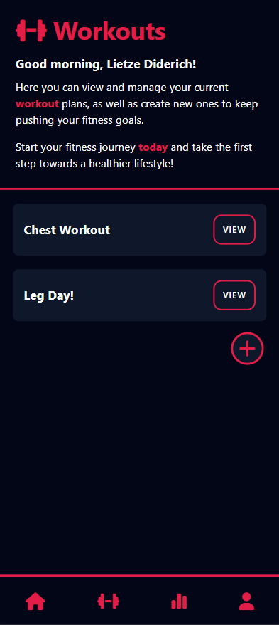
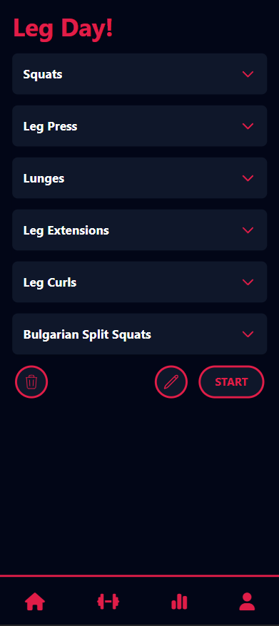
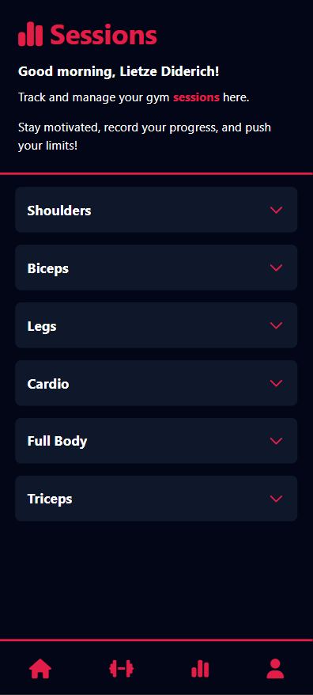

# gym-tracker

A PWA for tracking your workouts and progress.

# Table of Contents

- [Introduction](#introduction)

- [Installation](#installation)

  - [Clone the repository](#clone-the-repository)

  - [Running A Server](#running-a-server)

- [Database Structure](#database-structure)


# TODO
## Must
- [X] Pivot values to workout_exercise table
- [X] Add pivot values to frontend
- [ ] Fix navbar + responsiveness
- [ ] Feedback form for users on profile page
- [ ] Session crud for users
## Should
- [ ] Domain fix so site is live for beta testing
- [ ] Full profile page editability from Breeze
- [ ] BMI calculator with database


# Introduction

This Gym Tracker app is a Progressive Web App (PWA) that allows users to track their workouts and progress.

The project is mainly built for personal use, but friends have expressed interest in using it, so I will be making it available for beta testing soon.

[](https://www.laravel.com)
[](https://www.vuejs.org)


# Screenshots





# Installation

## Clone the repository

1. Clone the repository to your local machine.
```bash
git clone git@github.com:ldideric/gym-tracker.git
```

2. Navigate to the correct file.
```bash
cd gym-tracker
```

3. Copy the .env.example file to a .env file and configure the file to your liking. Make sure to set the database connection.
```bash
cp .env.example .env
```

4. Run the composer installation.
```bash
composer install
```

5. Run the npm installation.
```bash
npm install
```

6. Generate a new application key.
```bash
php artisan key:generate
```

7. Link the storage folder.
```bash
php artisan storage:link
```

8. Run the database migrations with the seeder (recommended):
```bash
php artisan migrate:fresh --seed
```

9. Run the npm builder.
```bash
npm run build
```

## Running A Server
To run a Laravel server you need to use the following terminal command. (The standard Laravel host is localhost:8000)
```bash
php artisan serve
```

# Database Structure

[](https://mermaid.live/edit#pako:eNqlVNtu4jAQ_RXLz4ASkgDJ6zaVUNWlIlR7EVLkxtNgNbEj21FhIf--5hICJGpV1U_2zPHMmTP2bHEiKOAAg7xjJJUkX3Jk1nMUztFu1--LLfo1mz_MnhcoQEu8IuqR8M0St2FRGEXT2c8uWB3hOmAc_g7nP6ZRWF-Zcbi50UAq0e_vdqg-x4s_T133ahIn-CX1F8gET9VC3GJPrD5g8xUWF8Jsj_v9emEp4xoxip4eGqvSkvEUcZJDywg5YVnLWhCl3oWkR0dVp6vr_DTjq5DAUj6l90KiUoGMDeD-I0rnHNdFf6u2vFRJBnEqRVk0Tg1rjSioRLJCM8Ebzz58QjIhGai4MKRzxksN3SI0b6bN0Uj3Jkp9W_TJC2uQCVNw6T5Hr1_L9yW-AnQwainekVOBUkaiLxRS66hAq2uLhOLG8m74rfRFZ1gOiJaSNG0xJHEP5yDNM6VmfhwoLrFegek33n8JSuTb_kNUBkdKLaINT3DwSjIFPVwWlGg4jZyztSD8rxDmrGVpjkCZFvLxOKAOc-oAwcEWr3Fgu8OBPbYmY9t3PM8Zu6Me3uBgOBlYlms7jj1yJ57vWU7Vw_8OUe2B5fjDkeu6lueMXN-v_gPZQnvY)

